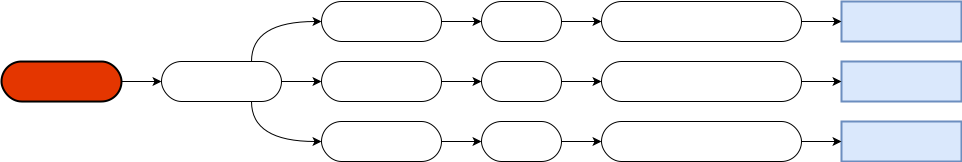

# CVR Asset Info
This component is a requirement and will be automatically added for **[CVR Avatar](../avatar/components/avatar.md)** / 
**[CVR World](../world/components/world.md)** / **[CVR Spawnable](../spawnable/components/spawnable.md)**.  
It is needed to identify your content in our backend infrastructure.

## Properties

### Unique Identifier

This field is only used to identify your Avatar/World/Prop when uploading, you can find your previous uploaded GUID's here

