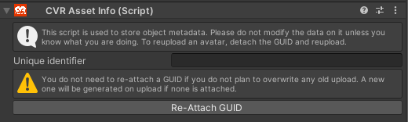
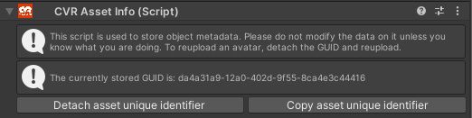

# CVR Asset Info 

The CVR Asset Info component is the component that defines the ownership and ID of an uploaded asset such as Avatars, Worlds, or Spawnables (also known as props) in our backend infrastructure. It is automatically generated as a subcomponent to the [CVR Avatar](CVR-Avatar.md), [CVR World](CVR-World.md), and [CVR Spawnable](CVR-Spawnable.md) components. 

## UI

__Unique Identifier__

- identifier (in text) used to determine the ID the gameobject will be uploaded to/as

__Re-Attach GUID__

- Attaches the ID in the __Unique Identifier__ field to the current gameobject

(when attached) __Detach asset unique identifier__

- Detaches GUID (but leaves last in field) so that it can be changed

(when attached) __Copy asset unique identifier__

- Copies GUID so that it can be used on another asset or stored (for example, 1 asset being uploaded to two accounts)

## Finding your Asset's GUID

You can find existing GUIDs for any of your own uploaded assets on the Hub by going to "My Content" and managing the appropriate asset type.

