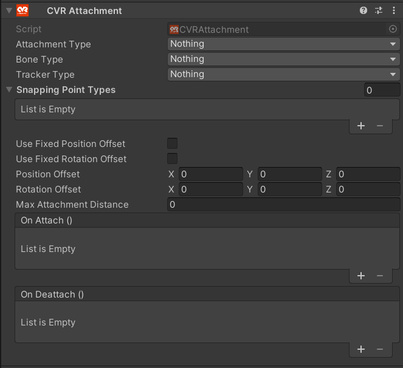

# CVR Attachment 

The CVR Attachment can be used to attach objects to a bone or a tracker. This can be used for props like hats and glasses.

## UI

#### Attachment Type
The type will define how and where your object will be attached.

- **Bone**

Attaches the object to a bone of an avatar.

- **Tracker**

Attaches the object to a tracker.

-  **Snapping Point**

Attaches the object to a snapping point reference.

#### Bone Type
Select the bones the attachment should be able to attach to.

!!! info
	The Bone Type dropdown, with the exception of Root, refers to unity humanoid rigs.

| Bone Type       |            |                |                |              |                 |
| --------------- | ---------- | -------------- | -------------- | ------------ | --------------- |
| Nothing         | Everything | Hips           | Spine          | Chest        | Upper Chest     |
| Neck            | Head       | Left Upper Leg | Left Lower Leg | Left Foot    | Right Upper Leg |
| Right Lower Leg | Right Foot | Left Shoulder  | Left Arm       | Left Forearm | Left Hand       |
| Right Shoulder  | Right Arm  | Right Forearm  | Right Hand     | Root         |                 |

#### Tracker
Select the trackers the attachment should be able to attach to.

!!! info "Tracker Types"
	Main Camera refers to the tracking for the player's viewpoint. Left and Right Hand track the _controller_, not the Hand transform. Additional Tracker is used for any additional trackers such as FBT or object tracking.

| Tracker Type |            |             |            |           |                    |
| ------------ | ---------- | ----------- | ---------- | --------- | ------------------ |
| Nothing      | Everything | Main Camera | Right Hand | Left Hand | Additional Tracker |

#### Use Fixed Position Offset
Offsets the object's position by the set amount in [Position Offset](CVRAttachment.md#position-offset).

#### Use Fixed Rotation Offset
Offsets the object's rotation by the set amount in [Rotation Offset](CVRAttachment.md#rotation-offset).

#### Position Offset
X, Y and Z offset position relative to the attached bone or tracker.

#### Rotation Offset
X, Y and Z offset rotation relative to the attached bone or tracker.

#### Max Attachment Distance
The maximum distance from a bone or tracker, in which it still can be attached.

## Example
#### A Wearable Hat

Please insert a video of setting up the CVR Pickup Object, Interactable, and CVR Attachment to make a hat. - Lily.