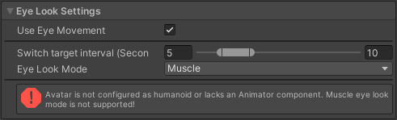
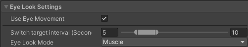
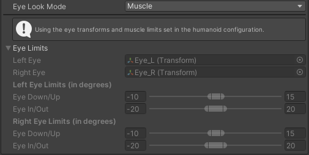
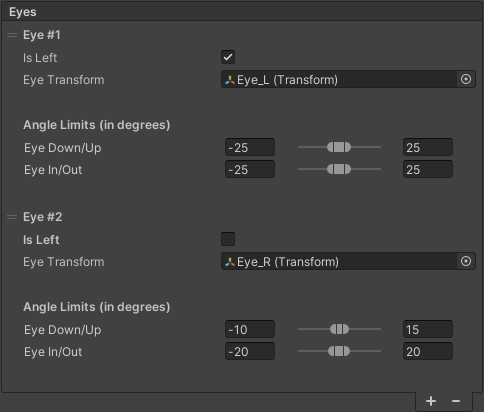

# CVR Avatar 

The CVR Avatar Component is necessary for making an avatar upload. To use this component, the GameObject must have a [Unity Animator component](https://docs.unity3d.com/2021.3/Documentation/Manual/class-Animator.html) and the [CVR Asset Info](CVR Asset Info.md) component. If these two components aren't present when the CVR Avatar component is added, they will be generated automatically.

Additionally, the CVR Avatar component includes an automatic generator for fundamental advanced avatar settings to aide in rapidly developing animators from scratch.

## Getting Started

While the process for uploading avatars is made as accessible as possible, there are still a few things that should be addressed before uploading. A more more complete and generalized guide for getting started with various assets can be found on our [Getting Started]() (add link) Page.

### Preparing a New Project

To begin any project, you will need the appropriate Unity version and current CCK version. Because this is a living game that has changes this documentation may not be able to keep up with, it is always suggested to follow the instructions on the [Setup Page](https://docs.abinteractive.net/cck/setup/) for getting the correct unity version and installing the CCK. You can get the Unity Hub management software [here](https://unity.com/download) or find individual Unity Editor versions [here](https://unity.com/releases/editor/archive).
Once you have the correct unity version installed, create a new project, import the CCK, and then import any assets you'll be using.
### Importing the CCK

point to current CCK

### Importing and Configuring Your Avatar

have a general guide for a basic humanoid setups, explain concept of generics

### General Information for Beginners

short list of explanations of quirks and important tidbits for/of unity and 3D modelling that would be relevant to avatars

## UI

The CVR Avatar component has 7 sections spanning a variety of customization, setup, and safety settings. Please note that while some fields or list items can be animated, not all of them can.
### General Avatar Settings

!!! hint
	The Voice Parent and View/Voice position Auto buttons are only present if the avatar is configured for Unity's Humanoid Rig. More information on this can be found [here](https://docs.unity3d.com/Manual/UsingHumanoidChars.html)

 

The General Avatar Settings menu has 3 settings, 2 of which are split into 3 sections for the X, Y, and Z position of the view and audio source. These settings function as follows:

- View Position: The point at which the in-game viewport camera originates. This can be edited from the inspector panel, or by grabbing the move gizmo's handle on the 🟢 (Green ball) in the scene view

- Voice Parent: Selects which bone the voice position rotates and translates with. The available options are Head, Left Hand, Right Hand, and Hips.

- Voice Position: The point at which player voice originates. This can be edited from the inspector panel, or by grabbing the move gizmo's handle on the 🔴 (Red ball) in the scene view
### Avatar Customization

Settings found in this menu are necessary for additional customization and setup options found beneath it. Making sure these fields are filled for anything other than extremely generic avatars also allows for things like face and eye tracking, lip sync, and any kind of animator customization.

!!! hint "Select the Correct Animator"
	When using an animation override controller please make sure that the one you have selected has the correct animator controller applied. If not, you will either not see any animation slots at all, or incorrect ones for the avatar you're editing.

**Animation Overrides**

The Animation Overrides field must be occupied by an Animator Override Controller that has the avatar's currently used Animator Controller applied to it if you would like to make use of custom animations, rename toggles or states in the Quick Menu, or use Advanced Avatar Settings.

**Face Mesh**

The Face Mesh field selects the [Skinned Mesh Renderer](https://docs.unity3d.com/2021.3/Documentation/Manual/class-SkinnedMeshRenderer.html) that you wish to use for any facial movement or tracking, such as lip sync or eye motion. This is **Required** for the [Eye Look Settings](CVRAvatar.md#eye-look-settings), [Eye Blink Settings](CVRAvatar.md#eye-blink-settings), and [Lip Sync Settings](CVRAvatar.md#lip-sync-settings) to populate correctly.

### Eye Look Settings

The Eye Look Settings menu holds settings for the specific way that automated eye movement functions as well as if it is even active at all. On top of the toggle for using eye look, there is a gaze duration slider as well as 4 different modes for changing the direction the avatar is looking (including none).

**Eye Look Mode**

The look direction of an avatar's eyes when not controlled by eye tracking can be defined in 3 ways, as well as being disabled (which overrides the "Use Eye Movement" Checkbox):

!!! hint "Is Left"
	Because the CCK allows you to create avatars with an arbitrary number of eyes, the "transform" and "blendshape" Eye Look Modes assume that you're defining a right eye unless "Is Left" is checked.

- Muscle:

Uses the [Unity Humanoid Rig's](https://docs.unity3d.com/2021.3/Documentation/Manual/UsingHumanoidChars.html) muscle settings and limits to define the range of motion.

- Transform

Uses the GameObject Rotation, position, and scale to define the eyes' rotation behavior.
- Blendshape
- None
waiting for video demo
### Eye Blink Settings
### Lip Sync Settings
### Advanced Tagging
### Advanced Settings

waiting for video demo

## Examples

Videos needed:
- animating blinking on/off
- nonstandard eye setup
- examples showing in-editor and in-game versions of each AAS item type
- (optionally) setup for eye/face tracking
- basic avatar setup guide
## Notes

animator component populates on upload with animator targeted by animator override controller in avatar customization section