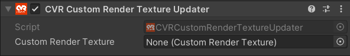

# CVR Custom Render Texture Updater 

The CVR Custom Render Texture Updater component calls the update method once each frame for a [Custom Render Texture](https://docs.unity3d.com/Manual/class-CustomRenderTexture.html). This is particularly useful for procedural render textures such as rain hitting the ground, water surface effects and ripples, and footprints in sand or snow.

## UI

#### Custom Render Texture
Select the Custom Render Texture to be updated each frame.