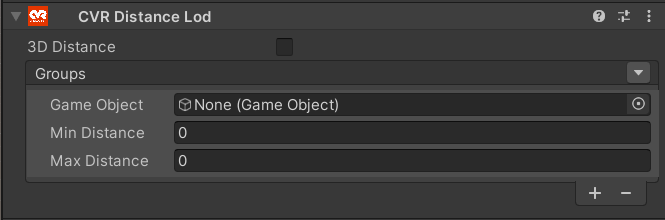
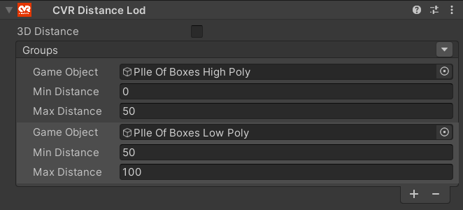

# CVR Distance Lod 

The CVR Distance Lod component can be used to hide or show GameObjects based on the components distance to the local player. This component is intended to help world creators manage performance.

## UI

#### 3D Distance
If enabled, the distance will be calculated in 3D space. If disabled, it will only be calculated in 2D space.

#### Groups
You can have multiple Groups where you can define the following:

**Game Object**: Select the game object you want to toggle.

**Min Distance**: The minimum distance required to set the GameObject active.

**Max Distance**: The maximum distance the object is active. After this point, it will be disabled.

## Examples

#### Setting Up Basic Level of Detail

!!! tip
	 You can copy the values of the [Transform](https://docs.unity3d.com/2021.3/Documentation/Manual/class-Transform.html) component and paste them to the other models transform for easier alignment.

To start: import your high detail model and your low detail model into the unity editor. Then once it is finished importing, add both models to your scene and position them.

Once that is done, add a new GameObject with the CVR Distance Lod component and position it to where you want the center of the distance detection to be.

Afterward, create the necessary amount of groups (in this example we have 2 groups) and add each of your models to a group.

!!! tip
	 When setting up a CVR Distance Lod the max distance of your high detail model should be the minimum distance of your low detail model.

Now just set up the distances you wish to hide one model and reveal the other.
## Notes

!!! note
	The distance measured in the CVR Distance Lod component is in meters.

!!! note
	The component can also be used to hide objects without swapping to a low detail model.