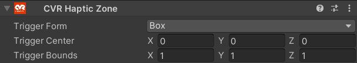
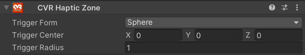
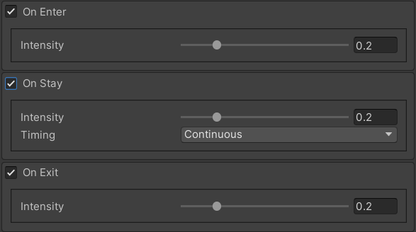

# CVR Haptic Zone 

The CVR Haptic Zone allows you to create a zone that will trigger the CVR Haptic Chest Area.

## UI

#### Trigger Form
Defines the trigger shape, you can choose from:

- **Box:** A box shape.
- **Sphere:** A sphere shape.

#### Trigger Center
Defines the origin position of the haptic trigger.

#### Trigger Bounds/Radius
Defines the bounds of the haptic trigger.

### Trigger Events

#### General Properties
##### Intensity
Defines how strong the haptics motors should vibrate.

#### On Enter
When enabled, the trigger will activate when entering the zone.

#### On Stay
When enabled, the trigger will activate while staying in the zone.

##### Timing

- **Once:**  
  Triggers only once when entering the trigger area.

- **Continuous:**  
  Will continuously trigger the haptic motors as long as they are within the zone.
  
!!! tip inline end  
     A tick refers to the Unity Physics Update Rate, which is 50 Hz.

- **Random:**  
  **Chance:**
  The chance to activate the haptic motors per tick.

#### On Exit
When enabled, the trigger will activate when exiting the zone.