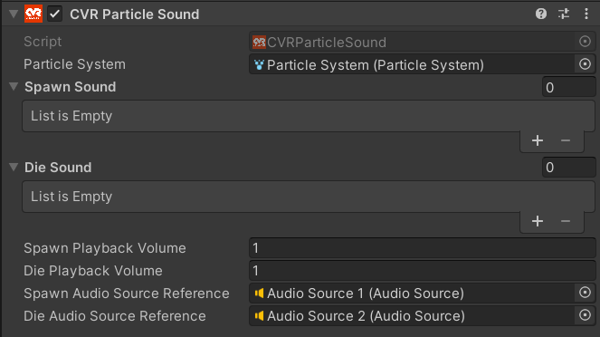
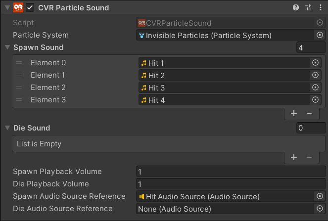

# CVR Particle Sound 

The CVR Particle Sound component allows you to play [Audio Clips](https://docs.unity3d.com/2021.3/Documentation/Manual/class-AudioClip.html) from a particles location when the particle is spawned or when the particle expires.
## UI

#### Particle System
Select the [Particle System](https://docs.unity3d.com/2021.3/Documentation/Manual/class-ParticleSystem.html) the component should react to.

!!! warning
	The CVR Particle Sound component will not work correctly if the Particle System has it's Simulation Space set to anything other than World.
#### Spawn Sound
A list of Audio Clips you want the component to play on particle spawn.

#### Die Sound
A list of Audio Clips you want the component to play on particle death.

#### Spawn Playback Volume
Volume of the particle spawn sound.

#### Die Playback Volume
Volume of the particle death sound.

## Examples

### Setting Up Randomized Audio

Start by creating a new Game Object with the CVR Particle Sound component and adding your Particle System to the Particle System field.

Next, import and add your Audio Clips to the CVR Particle Sound component.

!!! note
	The CVR Particle Sound component does not play the same Audio Clip for all listeners and can potentially be a different sound to everyone that hears it.

After, create and add an Audio Source to the method you want to use.

Now animate or manipulate your particle system to use your preferred method.
