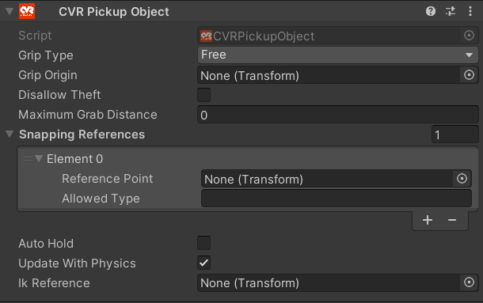

# CVR Pickup Object 

The CVR Pickup Object is a component that allows an object to be grabbed.

!!! warning
	 A CVR Pickup Object component will not function without a type of [Unity Collider](https://docs.unity3d.com/2021.3/Documentation/Manual/primitive-colliders.html) attached to the same GameObject.

## UI

#### Grip Type

- **Free**

Allows the player to grab the object without the object snapping or rotating to their hand.

- **Origin**

Allows the player to grab the object and have it snap to their hand using the Grip Origin as a reference point.

#### Grip Origin

!!! info
	When Grip Type is set to Free this section is disabled and hidden. (Khodrin make this happen - Lily)

The transform reference that is used when Grip Type is set to Origin.

#### Disallow Theft

Prevents a player from grabbing the object when another player is already holding the object.

#### Maximum Grab Distance

The maximum distance a player can grab the object from.

#### Snapping References

Snapping References are a list of [CVR Snapping Point](CVRSnappingPoint.md) types that the object can attach to.

 - **Reference Point**

The GameObject that the pickup will use as its center point when snapping to the snapping point.

- **Allowed Type**

The name of the snapping point the object should snap to.

#### Auto Hold

!!! tip "Dropping Automatically Held objects"
	The default binding to release an automatically held object is G (on desktop) or by squeezing your right grip and pulling the right stick down (in VR).

Makes the object automatically held in the players hand one picked up, preventing them from dropping the object accidentally.

#### Update With Physics

Updates the object with unity physics instead of moving with the hand each frame.

#### IK Reference

A transform that a desktop users right hand will reach up to and attempt to grab when holding the object. (Not implemented yet, poke Khodrin - Lily)