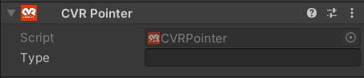
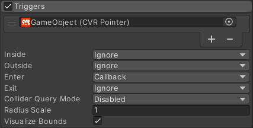

# CVR Pointer 

The CVR Pointer component is used to mark a gameobject so that other components can utilize it, such as the [CVR Interactable](), [CVR Spawnable Trigger](), [CVR Toggle State Trigger]() and [CVR Advanced Avatar Trigger]() components.

## UI

#### Type
The name of your pointer. This can be used by other components to filter out interactions.

## Examples

Needs an example of setting up a pointer to pair with various types of triggers. - Lily
#### Adding Pointers to Particles

!!! tip
	Particle Systems with pointers can only trigger OnEnter

To do so, simply add the CVR Pointer to the same gameobject as the particle system, then drag the CVR Pointer component to first available slot in the [Particle System Triggers](https://docs.unity3d.com/2021.3/Documentation/Manual/PartSysTriggersModule.html) section.

!!! warning
	 Triggering Kill and Callback at the same time results in Callback not activating. For example, having Inside Kill and Enter Callback.

Afterward be sure to set up Callback on whichever method you want to use.

## Notes

- CVR Pointer components on Spawnables only function when actively held by someone.

- A CVR Pointer can be paired with any kind of collider to make a larger pointer area or zone.

- When making a pointer for worlds, the pointer will need to be on or the child of a gameobject with a rigidbody.