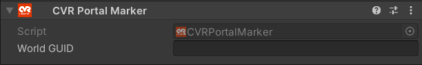
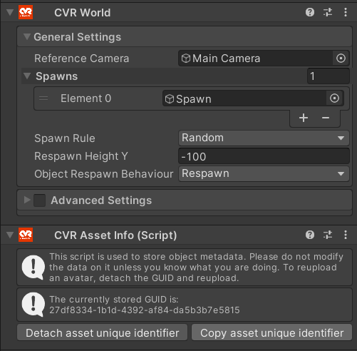

# CVR Portal Marker

## UI

#### World GUID
Enter the Globally Unique Identifier (GUID) of the world you want to create a portal for in here.

#### Copying Your World GUID
# (Replace this with the CVR Hub world/asset info - Lily)

You can find your World GUID in the **[CVR Asset Info](CVRAssetInfo.md)** component on the same GameObject as the [CVR World](CVRWorld.md) component. Use the "Copy asset unique identifier" button to copy the GUID to your clipboard.

!!! Note 
	The portal contains a [panopshere](https://en.wikipedia.org/wiki/Panorama) which is taken from the CVR World components location when uploading your world.