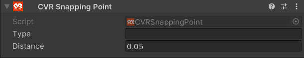

# CVR Snapping Point 

The CVR Snapping Point component creates a point of reference for the [CVR Pickup Object](CVRPickupObject.md) to snap to.

## UI 

#### Type
The name of the snapping point for the CVR Pickup Object component to reference in the [Snapping References](CVRPickupObject.md#snapping-references) section.

#### Distance
The distance the object must held be within to snap to the snapping point.