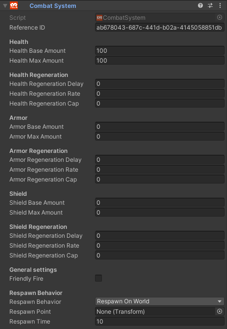
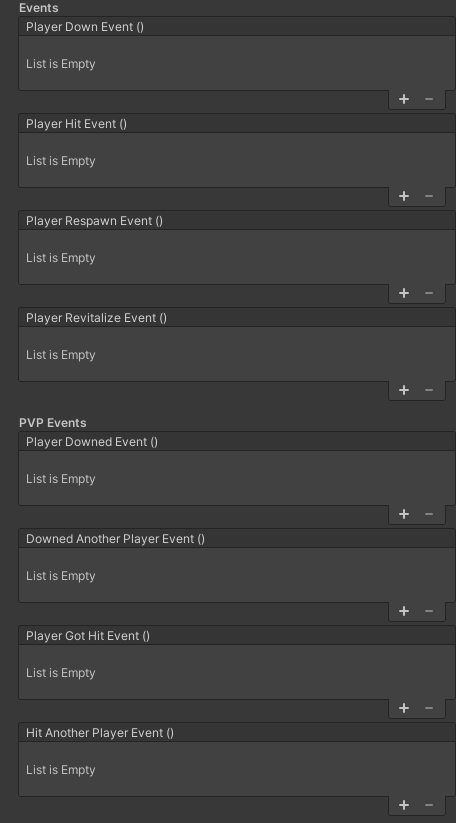

# Combat System 

Adding this component enables PvP and PVE style gamemodes in your world. Best used alongside the [Damage](Damage.md) Component and the [GameInstanceController](GameInstanceController.md) Component

### Properties

##### Reference ID
This property is read only, changing this value only break the component.

### Health
##### Health Base Amount
This is the default Health each player starts with at the beginning of a Game or Round.
##### Health Max Amount
This is the Maximum amount of Health a player can have at any given time.

### Health Regeneration
##### Health Regeneration Delay
The time in seconds before the player starts regenerating Health.
##### Health Regeneration Rate
The amount of Health the player recovers per second.
##### Health Regeneration Cap
The amount of Health that regeneration will stop.

### Armor
##### Armor Base Amount
This is the default Armor each player starts with at the beginning of a Game or Round.
##### Armor Max Amount
This is the Maximum amount of Armor a player can have at any given time.

### Armor Regeneration
##### Armor Regeneration Delay
The time in seconds before the player starts regenerating Armor.
##### Armor Regeneration Rate
The amount of Armor the player recovers per second.
##### Armor Regeneration Cap
The amount of Armor that regeneration will stop.

### Shield
##### Shield Base Amount
This is the default Armor each player starts with at the beginning of a Game or Round.
##### Shield Max Amount
This is the Maximum amount of Armor a player can have at any given time.

### Shield Regeneration
##### Shield Regeneration Delay
The time in seconds before the player starts regenerating Shield.
##### Shield Regeneration Rate
The amount of Shield the player recovers per second.
##### Shield Regeneration Cap
The amount of Shield that regeneration will stop.

### General Settings
##### Friendly Fire
Enable or Disable the ability for players to attack their own teammates.

### Respawn Behavior

Choose how the player will respawn upon being downed.

##### Respawn Behavior
+ **Respawn On World**  
  Uses the CVRWorld Spawn Point.
+ **Respawn On Point**  
  Uses the transform of the Respawn Point Property.
+ **Respawn In Place**  
  Will respawn the player at the point they were downed.
##### Respawn Point
The GameObject Transform property the player will respawn at when using the **Respawn On Point** Respawn Behavior.
##### Respawn Time
The time after being down the player will respawn.

### Events
These are hooks that can be triggered by the Combat System.

##### Player Down Event
This is triggered when player health reaches 0.
##### Player Hit Event
This is triggered when the player has been hit by the Damage component.
##### Player Respawn Event
This is triggered when the player respawns after being downed.
##### Player Revitalize Event
This is triggered if the player is given Health outside of Health Regeneration.

### PVP Events
These are hooks that can be triggered by the Combat System from other players.
##### Player Downed Event
This is triggered when a remote player brings the local player's health to 0.
##### Downed Another Player Event
This is triggered when the local player brings a remote player's health to 0.
##### Player Got Hit Event
This is triggered when the local player is hit by a remote player's Damage component.
##### Hit Another Player Event
This is triggered when the local player hits a remote player with a damage component.

### Shader Globals
These are globals from ChilloutVR exposed to shaders that are synced to the CombatSystem.

##### _CVRCombatSystemHealth
An interger value of your current Health.
##### _CVRCombatSystemArmor
An interger value of your current Armor.
##### _CVRCombatSystemSheild
An interger value of your current Sheild.