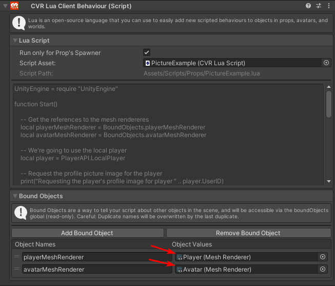

# Player Profile Picture

This is an example how we can request and use the player's profile and avatar's picture.

All you need to do, is create 2 planes. One for the player's picture and the other for the player avatar's picture, and
add their MeshRenderers as bound object.

Note: You need to add the components directly, if you add the gameObjects you need to call the GetComponent on the 
gameObject to get the mesh renderer reference. Notice on the image, it shows the icon of a MeshRenderer component and
not the gameObject.



```lua
UnityEngine = require "UnityEngine"

function Start()

    -- Get the references to the mesh rendereres
    local playerMeshRenderer = BoundObjects.playerMeshRenderer
    local avatarMeshRenderer = BoundObjects.avatarMeshRenderer

    -- We're going to use the local player
    local player = PlayerAPI.LocalPlayer

    -- Request the profile picture image for the player
    print("Requesting the player's profile image for player " .. player.UserID)
    player.RequestProfileImage(function(texture)
        -- Call the GetProfileImage while wrapping the function in a local create function
        -- so we can send some additional context (the player's reference, and the mesh renderer)
        OnPlayerProfileImage(texture, player, playerMeshRenderer)
    end, true)

    -- If the player has the avatar loaded, request the current avatar image for the player
    if player.Avatar.IsLoaded then
        print("Requesting the avatar's profile image for avatar " .. player.Avatar.AvatarID)
        -- Call the GetProfileImage while wrapping the function in a local create function
        -- so we can send some additional context (the player's avatar reference, and the mesh renderer)
        player.Avatar.RequestImage(function(texture)
            OnAvatarImage(texture, player.Avatar, avatarMeshRenderer)
        end, true)
    end
end

function OnPlayerProfileImage(texture, player, playerMeshRenderer)
    print("Received the Player Profile Image for user " .. player.UserID .. "! " .. tostring(texture))
    if texture == nil then
        print("Unfortunately it was nil :(")
        return
    end
    -- Get the current material on the meshrenderer and set the texture
    -- The material SetTexture requires a Texture instance, and not Texture2D
    -- which is why we called GetProfileImage with the second arg true, so the
    -- texture is returned as a Texture instead of Texture2D
    local materialInstance = playerMeshRenderer.material
    materialInstance.SetTexture("_MainTex", texture)
end

function OnAvatarImage(texture, avatar, avatarMeshRenderer)
    print("Received the Avatar Profile Image for avatar " .. avatar.AvatarID .. "! " .. tostring(texture))
    if texture == nil then
        print("Unfortunately it was nil :(")
        return
    end
    -- Get the current material on the meshrenderer and set the texture
    -- The material SetTexture requires a Texture instance, and not Texture2D
    -- which is why we called GetProfileImage with the second arg true, so the
    -- texture is returned as a Texture instead of Texture2D
    local materialInstance = avatarMeshRenderer.material
    materialInstance.SetTexture("_MainTex", texture)
end
```
